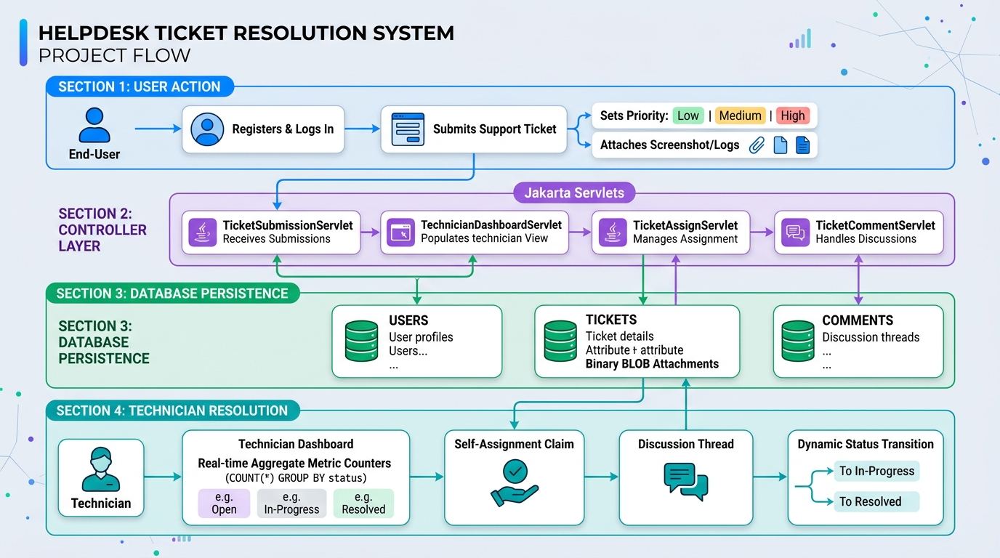

# Helpdesk Ticket Resolution System (StackRoute Capstone)

A centralized, secure, and scalable Java EE / Jakarta-compatible web application developed for the StackRoute Capstone Project to automate logging, tracking, technician assignment, and resolution of IT support requests.



---

## 1. Features & Checkpoints Implemented

- **Ticket Submission**:
  - Open tickets specifying priority (`LOW`, `MEDIUM`, `HIGH`).
  - Attach screenshot images or system logs stored directly into the database as binary `BLOB` (with preview & download via `AttachmentDownloadServlet`).
- **Technician Command Dashboard**:
  - Real-time aggregate metric counters driven by aggregate SQL queries (`COUNT(*) GROUP BY status`).
  - View unassigned ticket queue sorted by priority.
  - Technicians assign open tickets to themselves with one click.
  - View individual active assignments.
- **Ticket Discussion Thread**:
  - Chronological discussion messages between ticket owners and support engineers.
  - Handled by `TicketCommentServlet` with dynamic status lifecycle updates (`OPEN` -> `IN_PROGRESS` or `RESOLVED`).
- **Polyglot & Multi-Database Support**:
  - DDL schema scripts provided for **Oracle** (`schema-oracle.sql`), **MySQL** (`schema-mysql.sql`), and **H2** (`schema-h2.sql`).
  - Configurable via `src/main/resources/db.properties`.

---

## 2. Default Demo Accounts

| Role | Name | Email | Password |
|---|---|---|---|
| **Technician** | Bhavani | `bhavani.tech@company.com` | `tech123` |
| **Technician** | Nithya | `nithya.tech@company.com` | `tech123` |
| **Technician** | Jeevan | `jeevan.tech@company.com` | `tech123` |
| **User** | John Doe | `john@example.com` | `user123` |
| **User** | Jane Smith | `jane@example.com` | `user123` |
| **Admin** | IT Admin | `admin@company.com` | `admin123` |

*(The login page also provides one-click demo autofill buttons).*

---

## 3. Technology Stack

- **Front End**: JSP 2.3, JSTL 1.2, Bootstrap 5.3, Bootstrap Icons
- **Back End**: Java Servlets (with `@MultipartConfig`, `@WebServlet`), MVC Architecture
- **Database**: Oracle / MySQL / H2 In-Memory
- **Build Tool**: Apache Maven (produces `target/helpdesk.war`)

---

## 4. How to Build & Test

### Run Unit & Integration Tests:
```bash
mvn clean test
```

### Build Deployable WAR:
```bash
mvn clean package
```
Generates `target/helpdesk.war` ready to deploy into Apache Tomcat `webapps/`.

---

## 5. Database Configuration

Edit `src/main/resources/db.properties` to switch database backends:

### To Use Oracle:
```properties
db.type=oracle
oracle.driver=oracle.jdbc.OracleDriver
oracle.url=jdbc:oracle:thin:@localhost:1521:xe
oracle.user=YOUR_ORACLE_USER
oracle.password=YOUR_ORACLE_PASS
```
Execute `src/main/resources/schema-oracle.sql` in Oracle SQL Developer / SQL*Plus.

### To Use MySQL:
```properties
db.type=mysql
mysql.driver=com.mysql.cj.jdbc.Driver
mysql.url=jdbc:mysql://localhost:3306/helpdeskdb?useSSL=false&allowPublicKeyRetrieval=true&serverTimezone=UTC
mysql.user=root
mysql.password=root
```
Execute `src/main/resources/schema-mysql.sql` in MySQL Workbench or CLI.

### Embedded H2 (Default):
Runs immediately out of the box with zero external setup needed for evaluations and testing.